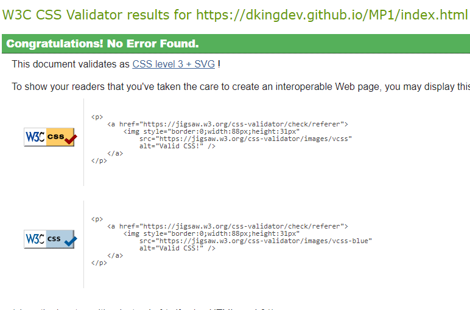
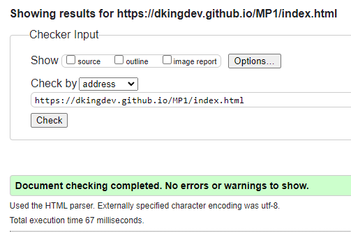

# **Spirit of the snow**

This is the start of a website called Spirit of the snow, which has been created for Milestone Project One.

## TABLE OF CONTENTS
* [Introduction](#Introduction)
* [Technologies Used](#Technologies-used)
  * [Frameworks, Programs, and Libraries](#Frameworks-Programs,--Libraries)
  * [Languages](#Languages)
* [Features](#Features)
* [Design](#Design)
  * [Typography](#Typography)
  * [Color Palette](#Color-Palette)
* [Testing](#Testing)
* [Deployment](#Deployment)
* [Attribute](#Attribute)

## Introduction

The aim for this website, is to provide all the information for skiing activities in one place, allowing users to avoid multiple searches from their browser. Each location provided will allow users to go directly to the correct website for all information on what the sports centre provides, including opening times, contact details in full, and cost for each activity provided.

## Technologies Used

### Frameworks, Programs, and Libraries

 - [GitHub](https://github.com):
    - GitHub has been used to store this project.
 - [Google Fonts](https://fonts.google.com): 
    - was used to create the footer icons and to retrieve the font family files.
 - [VScode](https://code.visualstudio.com):
    - Was used along side Codeanywhere IDE as a standby when issues occurred.
 - [Codeanywhere](https://codeanywhere.com/):
    - Codeanywhere has been used to code and develope this website and to push to GitHub.
 - [W3schools](https://www.w3schools.com):
    - This CSS library was used to assist with the developement of this website.
 - [Am I Responsive](https://ui.dev/amiresponsive):
    - Am I Responsive was used to test display compatibilities for all devices.

## Features

This website contains the following features:

- Responsive layout throughout to adjust to many different sizes.
- Nice simple navigation menu which takes you to three different pages and is highlighted for the current page being visited.
- Contact form, which allows users to request help or further information. This feature also provides a "Thank you" response.
- Active locations list which allows the user to go directly to the sports centers they choose.
- Each visited page has a "return to top" feature.

## Design

### Typography

Google [fonts](assets/fonts)  was used for this website:
- Geologica, PTSans, and Roboto are used throughout.
- Roboto and PTSans are used for the main information.

### Color Palette

The color choice for this website was chosen to keep it easy on the eyes and to blend with the images, while providing colors for importance or guidance for navigation and the "return to top" feature.
The color palette below was created using [Cooloers](https://coolors.co)

## Tesing

All testing for the website was done via a web based validator:
- CSS Validator [jigsaw](https://jigsaw.w3.org/css-validator/) 
- HTML Validator [W3C](https://validator.w3.org)

## Deployment

This website is deployed using GitHub Pages. The following steps to deploy are as follows:
  1. Once signed in to GitHub, go to your GitHub repository.
  2. Click on the "settings" option at the top right of your repositary.
  3. Scroll down to the "GitHub Pages" section.
  4. In the "Source" section, select the branch (Main or Master)
  5. Once the branch and directory is selected, click on the "save" button.
  6. Wait a few moments, to allow the GitHub Pages to generate a URL.
  7. Copy the URL provided, and the website can now be accessed via your browser.

This website is live! You can it check out [here](https://dkingdev.github.io/MP1/)

## Attribute

The home page image was created using  [Vista Logo](https://www.vistaprint.co.uk/logomaker).

Credit for the outline text! [kyle](https://stackoverflow.com/questions/4919076/outline-effect-to-text).

[TheDigitalArtist](https://pixabay.com/illustrations/contact-us-help-desk-contact-help-1524408/) for the Contact us image.

Thank you for the image which is being used on the main home page [FunkyFocus](https://pixabay.com/photos/ski-snow-sports-winter-mountains-2033184/)

[Kirill Zenin](https://www.pexels.com/photo/people-in-a-ski-resort-10878618/) for the image which is on the locations page.

## License
This project is licenced under the MIT License - see the [LICENSE](License.txt)

